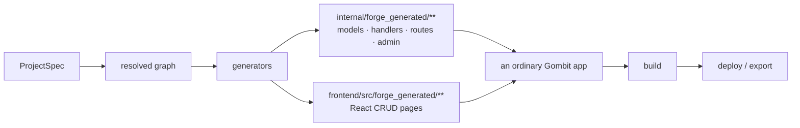

# Gombit Forge

[](https://github.com/gombit-dev/gombit-forge/actions/workflows/ci.yml)
[](https://go.dev/dl/)
[](LICENSE)
[](https://github.com/gombit-dev/gombit)

**Build visually. Ship normally. Own the code.** Forge is a visual application
builder that compiles a declarative `ProjectSpec` into an ordinary
[Gombit](https://github.com/gombit-dev/gombit) application — Go + GORM + Huma
API, a React + TypeScript frontend, Atlas migrations, cookie/session auth, and a
working admin. The output is a normal repository you build, run, and export; it
has **no runtime dependency on Forge**.

```go
files, err := compiler.Compile(spec, "example.com/acme")
// → internal/forge_generated/**  +  frontend/src/forge_generated/**
//    an ordinary Gombit app, byte-identical every time
```

> **Status: pre-alpha.** The M0 compiler gate is cleared and proven end to end;
> the control plane is under construction. See [Status](#status).

## Why Forge

Low-code builders get you to a running screen fast and then trap you: the app
lives inside a proprietary runtime, the generated code is either hidden or a
one-way export you can't feed back, and the day you outgrow the tool you start
over. Forge's position is that a visual builder should be a **compiler**, not a
runtime:

- **The spec is the source of truth, not the code.** You edit a declarative
  `ProjectSpec` — resources, fields, relationships, pages. Forge compiles it;
  the generated source is an artifact, never a round-trip you hand-edit.
- **The output is an ordinary app you own.** No Forge SDK, no callback to a
  Forge service, no vendor lock. Delete Forge and a deployed app keeps running.
  Export to GitHub is a first-class, mandatory feature — not a locked door.
- **Forge builds nothing Gombit already owns.** Routing, ORM, migrations, auth,
  admin, OpenAPI, and the TypeScript client are Gombit's. Forge only synthesizes
  the resource-specific code that consumes them — and Forge itself is a Gombit
  application, so it dogfoods the framework it targets.

## What's in the box

| | |
| --- | --- |
| **Spec** | `ProjectSpec` with stable IDs, canonical JSON, a hash, and an accumulating semantic validator (`internal/spec`) |
| **Graph** | the resolved domain model — `belongs_to` edges with derived `has_many` inverses, resolved query capabilities (`internal/compiler/graph`) |
| **Generators** | GORM models, Huma handlers, route + admin registration, and a React CRUD frontend, all under `forge_generated/**` (`internal/compiler/gen`) |
| **Pipeline** | `Compile(spec, module)` runs every stage into one **deterministic** file tree (`internal/compiler`) |
| **Pages** | structured tables, forms, details, and dashboards — with server-side search, filter, sort, FK-embedded related records, recent lists, and numeric aggregate cards |
| **Toolchain boundary** | a coarse, versioned seam to the Gombit CLI for scaffolding and migrations — never a per-entity subprocess (`internal/gombit`) |
| **Control plane** | Forge-as-a-Gombit-app: cookie auth, org tenancy with roles, and immutable append-only project revisions (`controlplane/`) |

## How it works



Forge owns **application synthesis** (the resource-specific code); Gombit owns
**framework primitives** (routing, ORM, migrations, auth, admin, the OpenAPI
document and TypeScript client). Generated code only ever *consumes* Gombit's
public APIs — it never reimplements or vendors them
([ADR-004](docs/ADR-004.md)). The runtime primitives beyond the source itself —
build, preview, deploy, managed database, secrets, domains — belong to Gombit
Cloud, not Forge ([ADR-005](docs/ADR-005.md)).

The whole product fits in one sentence, and it is the test every feature must
pass:

> **Forge edits a declarative application model; Gombit turns that model into
> ordinary software.**

## Quick start

**Prerequisites:** Go 1.25+ (the toolchain auto-resolves via `GOTOOLCHAIN`).
Generating and running a real application also needs the
[`gombit`](https://github.com/gombit-dev/gombit) CLI (**≥ v0.1.12**),
[Atlas](https://atlasgo.io), and Docker (Atlas diffs migrations against a
throwaway Postgres). The compiler library itself depends only on `gorm` and
`shopspring/decimal`.

```bash
git clone https://github.com/gombit-dev/gombit-forge
cd gombit-forge

go test ./... -short   # fast unit tests, no external toolchain
make all               # the full CI gate: fmt, vet, tests, skill-tree check
```

Forge is a library today — you drive the compiler from Go. This builds a
two-resource spec and prints the file tree the compiler would write:

```go
package main

import (
	"fmt"
	"log"

	"github.com/gombit-dev/gombit-forge/internal/compiler"
	"github.com/gombit-dev/gombit-forge/internal/spec"
)

func main() {
	customer := spec.MustNewID(spec.KindResource)

	s := &spec.ProjectSpec{
		SpecVersion: spec.SpecVersion,
		Project:     spec.Project{ID: spec.MustNewID(spec.KindProject), Name: "Acme CRM", Slug: "acme-crm"},
		Database:    spec.Database{Driver: spec.DriverPostgres},
		Auth:        spec.Auth{Mode: spec.AuthCookie},
		Resources: []*spec.Resource{
			{
				ID: customer, Label: "Customer", LabelPlural: "Customers",
				CodeName: "Customer", StorageName: "customers",
				Behavior: spec.ResourceBehavior{CreateEnabled: true, UpdateEnabled: true, DeleteEnabled: true, AdminVisible: true},
				Fields: []*spec.Field{
					{ID: spec.MustNewID(spec.KindField), Label: "Email", Type: spec.TypeString,
						CodeName: "Email", StorageName: "email", Required: true, Unique: true},
					{ID: spec.MustNewID(spec.KindField), Label: "Active", Type: spec.TypeBoolean,
						CodeName: "Active", StorageName: "active"},
				},
			},
			{
				ID: spec.MustNewID(spec.KindResource), Label: "Invoice", LabelPlural: "Invoices",
				CodeName: "Invoice", StorageName: "invoices",
				Behavior: spec.ResourceBehavior{CreateEnabled: true, AdminVisible: false},
				Fields: []*spec.Field{
					{ID: spec.MustNewID(spec.KindField), Label: "Customer", Type: spec.TypeBelongsTo,
						CodeName: "Customer", StorageName: "customer_id", Required: true, Target: customer},
					{ID: spec.MustNewID(spec.KindField), Label: "Total", Type: spec.TypeDecimal,
						CodeName: "Total", StorageName: "total", Required: true},
				},
			},
		},
	}

	files, err := compiler.Compile(s, "example.com/acme") // module = the generated app's Go module path
	if err != nil {
		log.Fatal(err)
	}
	for _, f := range files {
		fmt.Println(f.Path)
	}
}
```

The `invoice` resource emits no `admin.go` (it is not admin-visible) — the only
file its toggles drop. The output is deterministic: the same compiler version
and spec produce byte-identical files. The
[tutorial](docs/tutorial.md) turns this tree into a running app —
scaffold, migrate, build, boot.

To watch the whole loop against a real toolchain, run the go/no-go proof, which
scaffolds a Gombit app, migrates on Postgres, builds, boots, and exercises CRUD
plus admin (it skips automatically without `gombit`/`atlas`/Docker):

```bash
go test ./internal/compiler -run TestM0EndToEnd -v
```

## Status

**Pre-alpha.** The pieces exist in this order of maturity:

- **Compiler — done and proven.** The **M0 go/no-go gate is cleared**: from a
  `ProjectSpec`, Forge generates a Gombit app that compiles, migrates on
  Postgres, boots, serves CRUD over `/api/v1/…`, catalogs resources through the
  admin API, and carries no Forge dependency — end to end in `TestM0EndToEnd`.
  On top of it the structured page builder generates tables, forms, details, and
  dashboards, with server-side search / filter / sort, FK-embedded related
  records, recent-record lists, and numeric aggregate cards.
- **Control plane — under construction.** `controlplane/` is Forge as an ordinary
  Gombit application (dogfooding, locked decision D7): cookie/session auth, org
  tenancy with per-org roles and an invitation flow, and immutable, append-only
  project revisions that pin the exact canonical spec bytes and hash. The
  authoring HTTP API and the editor SPA are in progress.
- **Runtime (build / preview / deploy) — delegated, not yet integrated.** These
  belong to Gombit Cloud ([ADR-005](docs/ADR-005.md)); Forge compiles a revision
  and hands off the source. GitHub source export already ships as an async job.

There is no hosted visual editor or one-click deploy yet — those are milestones
M1 and M4–M6. [`docs/DESIGN.md`](docs/DESIGN.md) is authoritative for scope and
the roadmap; [`AGENTS.md`](AGENTS.md) is the single source kept current for what
has actually shipped.

## Locked decisions

Settled in [DESIGN.md §33](docs/DESIGN.md) and [ADR-001](docs/ADR-001.md); a
change that reopens one needs an ADR, not a pull request:

- **spec-first** — `ProjectSpec` is the source of truth; generated source is not
  an editable round-trip (D1).
- **compiler, not runtime** — generated apps are ordinary Gombit apps with no
  Forge runtime; a deployed app keeps working if Forge vanishes (D2).
- **structured pages** — tables, forms, details, dashboard; no freeform canvas (D6).
- **export is mandatory and one-way** (D10/D11).
- **use Gombit's contracts** — never build a Forge-specific auth, migration, API,
  admin, or ORM (D12).
- **identity is the stable ID, never the name** — a relabel is never a source-symbol
  change; symbols are minted once and frozen ([ADR-001](docs/ADR-001.md)).

## Documentation

- [**Tutorial**](docs/tutorial.md) — build and run a two-resource app end to end.
- [**Design**](docs/DESIGN.md) — product scope, milestones, and the locked MVP decisions.
- [**ADR-001**](docs/ADR-001.md) — identity, symbol allocation, file ownership, the extension ABI.
- [**ADR-004**](docs/ADR-004.md) — generation ownership: framework primitives vs application synthesis.
- [**ADR-005**](docs/ADR-005.md) — the Forge / Gombit Cloud boundary.
- [**AGENTS.md**](AGENTS.md) — the working agreement and the current, up-to-date state.

## Contributing

Issues and pull requests are welcome — start with
[CONTRIBUTING.md](CONTRIBUTING.md).

- [Open an issue](https://github.com/gombit-dev/gombit-forge/issues/new)
- [Security policy](SECURITY.md) — report vulnerabilities privately, not as issues
- [Code of conduct](CODE_OF_CONDUCT.md)

## License

[AGPL-3.0](LICENSE) © Gombit Forge. By contributing, you agree your contributions
are licensed under the same terms.
